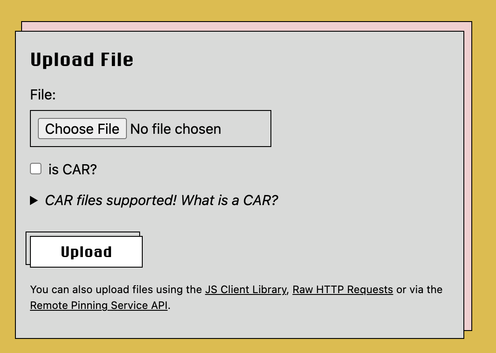

> [NFT.Storage](http://NFT.Storage) makes it easy to follow NFT best-practices, maximizing the value of NFTs you're minting and minimizing the overhead of maintaining the NFTs for NFT minters and owners

One of the powerful features of NFTs is that they can reference off-chain data, saving you the cost of storing your images, videos, and other large NFT data on-chain. An example of this is with the ERC-1155 standard, which defines places where you should reference data off-chain via URIs:

- Metadata: In the transaction itself, you need to include a URI that points to a JSON file containing the metadata for your NFT
- Image: The standard defines the `image` field in the metadata, whose value is a URL that points to an image associated with your NFT
- Other data: The standard defines the `properties` field in the metadata, which includes another JSON object that allows the user to define custom fields, which often reference URLs that point to other off-chain data (e.g., videos)

<!-- TODO: <example of ERC-1155 transaction with IPFS URL for metadata with an arrow pointing to the metadata> -->

## Pitfalls with using HTTP URIs

However, when minting an NFT, you need to be really careful about what kind of URI you use. Using HTTP URLs makes your NFT less valuable, since they reference a specific location on the Web. With an NFT that has HTTP URLs, potential buyers might be thinking:

- What happens if the people running the HTTP servers decide to swap out the data that my NFT is referencing? If I try to show off my NFT to others, art that is different than what I had initially purchased will show up.
- What happens if these HTTP servers go down completely? Even if I still own a copy of the art, I have no way to prove using on-chain data that my NFT was pointing to this specific artwork.

Since NFT ownership might frequently switch hands, the NFT owner and the HTTP server maintainer are often not going to be the same, which can create unclear or unbalanced incentives for keeping NFT data available in perpetuity.

## [NFT.Storage](http://NFT.Storage) to the rescue

This is why [NFT.Storage](http://NFT.Storage) gives you [IPFS](https://ipfs.io/) URIs rather than HTTP URLs. IPFS URIs are unique identifiers of the underlying data based on cryptographic hashes of the data itself, rather than the location where the data sits today. That way, you can easily prove that a piece of data is actually a part of your NFT! Further, as long as a copy exists somewhere on the IPFS network (on a public IPFS node, on Filecoin, even on your own computer running an IPFS node), you can download a copy of that data.

Click [here](https://proto.school/content-addressing) to read more about the power of content addressing!

```js
import { NFTStorage, File } from 'nft.storage'
import { pack } from 'ipfs-car/pack';

const apiKey = 'YOUR_API_KEY'
const client = new NFTStorage({ token: apiKey })

const metadata = await client.store({
  name: 'Pinpie',
  description: 'Pin is not delicious beef!',
  image: new File([/* data */], 'pinpie.jpg', { type: 'image/jpg' })
})
console.log(metadata.url)
// ipfs://bafyreib4pff766vhpbxbhjbqqnsh5emeznvujayjj4z2iu533cprgbz23m/metadata.json
```

There are other ways to get data onto IPFS and help ensure that data stays up (e.g., [add data to your own node](https://docs.ipfs.io/how-to/command-line-quick-start/) and use a [pinning service](https://docs.ipfs.io/how-to/work-with-pinning-services/)), but [NFT.Storage](http://NFT.Storage) simplifies the process for you. You upload data using a simple API, and behind the scenes, the service makes the data available on IPFS and puts the data into Filecoin deals. The service currently renews these deals for you to ensure your data deals never expire, but there are also improvements underway to ensure forever persistence with no dependency on NFT.Storage. 

Filecoin's unique combination of verifiable proof of storage and open market protocols allow for solutions that can ensure persistence through smart contract interactions, for example, creating "data DAOs" that auto-renew storage deals on any time scale from days to centuries. Using NFT.Storage today positions you to take advantage of these future upgrades with no extra work from your end!

## Quickstart

**Ready to get started using NFT.Storage right now?** Get up and running in minutes by following this quickstart guide. In this guide, we'll walk through the following steps:

1. [Create an NFT.Storage account](#create-an-account)
1. [Uploading a file via the website](#uploading-a-file-using-the-website)
1. [Get a free API token](#get-an-api-token)
1. [Using the JavaScript API](#using-the-javascript-api)

**This guide uses Node.js since it's the fastest way to get started using the Web3.Storage JavaScript client programmatically**, but don't worry if Node isn't your favorite runtime environment — or if you'd rather not do any coding at all. You can also use NFT.Storage in the following ways:
- Using the JavaScript client in web browsers.
- Upload and retrieve files directly from your [Files page](https://nft.storage/files/) on the NFT.Storage website.

You can also use the [HTTP API][reference-http-api] directly using any programming language or tooling that can send HTTP requests.

<!-- TODO(yusef): link to generated clients (python, etc) -->

:::tip
When using the HTTP API, make sure to read about [CAR files][concepts-car-files] to learn how to support large uploads!
:::

### Create an account

For this guide, you'll need an NFT.Storage account to get your API token and manage your stored data. You can sign up **for free** using your email address or GitHub.

import Tabs from '@theme/Tabs';
import TabItem from '@theme/TabItem';

<Tabs>
<TabItem value="email" label="Sign up using email">

1. Go to [nft.storage/login](https://nft.storage/login) to get started.
1. Enter your email address.
1. Check your inbox for a verification email from NFT.Storage, and click the **Log in** button in the email.
1. You're all set!

</TabItem>
<TabItem value="github" label="Sign up using GitHub">

1. Go to [nft.storage/login](https://nft.storage/login) to get started.
1. Click **GitHub** on the Login screen.
1. **Authorize** Web3.Storage when asked by GitHub.
1. You're all set!

</TabItem>
</Tabs>

### Uploading a file using the website

Once you're logged in, you can get started with NFT.Storage right away by uploading files using the website.

1. Click **Files** to go to your [NFT.Storage file listing page](https://nft.storage/files/). 
1. Click the **Upload** button to go to the [File upload page](https://nft.storage/new-file/).
1. Click the **Choose File** button to select a file from your device:
    
1. If you're uploading a [CAR file][concepts-car-files], tick the **is CAR?** check box.
1. Click the **Upload** button to store your file!

Once the upload is complete, you'll be able to view your file in the [file listing page](https://nft.storage/files/).

### Get an API Token

It only takes a few moments to get a free API token from NFT.Storage. This token enables you to interact with the NFT.Storage service without using the main website, enabling you to incorporate files stored using NFT.Storage directly into your applications and services.

1. Click **Account** to go to your [NFT.Storage account page](https://nft.storage/account).
1. Click **Create an API token**.
1. Enter a descriptive name for your API token and click **Create**.
1. Make a note of the **Token** field somewhere secure where you know you won't lose it. You can click **Copy** to copy your new API token to your clipboard.

:::warning Keep your API token private 
Do not share your API token with anyone else. This key is specific to your account.
:::


### Using the JavaScript API

<!-- TODO(yusef): add simple node upload example -->


[reference-http-api]: https://nft.storage/api-docs/
[concepts-car-files]: ./concepts/car-files.md

