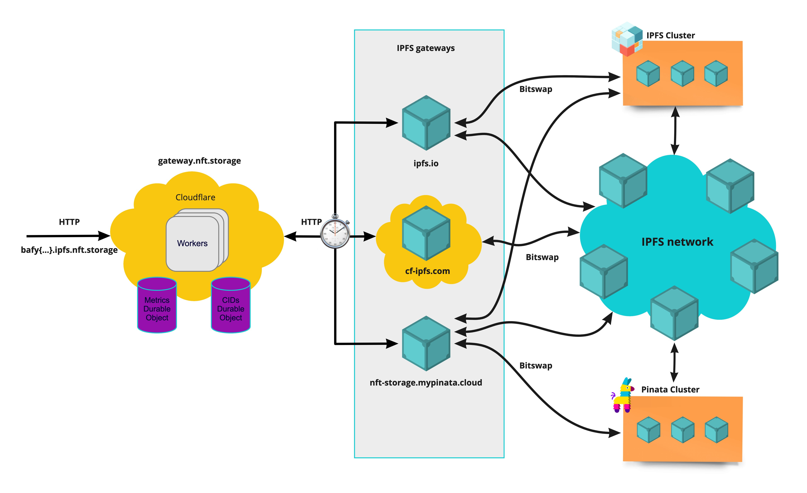

# gateway.nft.storage

> The IPFS gateway for nft.storage.

## Getting started

One time set up of your cloudflare worker subdomain for dev:

- `npm install` - Install the project dependencies
- Sign up to Cloudflare and log in with your default browser.
- `npm i @cloudflare/wrangler -g` - Install the Cloudflare wrangler CLI
- `wrangler login` - Authenticate your wrangler cli; it'll open your browser.
- Copy your cloudflare account id from `wrangler whoami`
- Update `wrangler.toml` with a new `env`. Set your env name to be the value of `whoami` on your system you can use `npm start` to run the worker in dev mode for you.

  [**wrangler.toml**](./wrangler.toml)

  ```toml
  [env.bobbytables]
  workers_dev = true
  account_id = "<what does the `wrangler whoami` say>"
  ```

- Add secrets

  ```sh
    wrangler secret put SENTRY_DSN --env $(whoami) # Get from Sentry (not required for dev)
    wrangler secret put LOGTAIL_TOKEN --env $(whoami) # Get from Logtail
    wrangler secret put S3_BUCKET_REGION --env $(whoami) # e.g us-east-2 (not required for dev)
    wrangler secret put S3_ACCESS_KEY_ID --env $(whoami) # Get from Amazon S3 (not required for dev)
    wrangler secret put S3_SECRET_ACCESS_KEY_ID --env $(whoami) # Get from Amazon S3 (not required for dev)
    wrangler secret put S3_BUCKET_NAME --env $(whoami) # e.g web3.
  ```

- `npm run publish` - Publish the worker under your env. An alias for `wrangler publish --env $(whoami)`
- `npm start` - Run the worker in dev mode. An alias for `wrangler dev --env $(whoami)`

You only need to `npm start` for subsequent runs. PR your env config to the `wrangler.toml` to celebrate 🎉

## High level architecture



The IPFS gateway for nft.storage is not "another gateway", but a caching layer for NFT’s that sits on top of existing IPFS public gateways.

## Usage

nft.storage Gateway provides IPFS path style resolutions `https://nftstorage.link/ipfs/{cid}` as follows:

```
> curl https://nftstorage.link/ipfs/bafkreidyeivj7adnnac6ljvzj2e3rd5xdw3revw4da7mx2ckrstapoupoq
Hello nft.storage! 😎
> curl https://nftstorage.link/ipfs/QmT5NvUtoM5nWFfrQdVrFtvGfKFmG7AHE8P34isapyhCxX
...
```

In practice, when nft.storage Gateway receives a IPFS path style request, it will redirect to a subdomain style resolution maintaining compliance with the [same-origin policy](https://en.wikipedia.org/wiki/Same-origin_policy). The canonical form of access `https://{CID}.ipfs.nftstorage.link/{optional path to resource}` causes the browser to interpret each returned file as being from a different origin.

```
curl https://bafkreidyeivj7adnnac6ljvzj2e3rd5xdw3revw4da7mx2ckrstapoupoq.ipfs.nftstorage.link
Hello nft.storage! 😎
```

Please note that subdomain resolution is only supported with [CIDv1](https://docs.ipfs.io/concepts/content-addressing/#identifier-formats) in case-insensitive encoding such as Base32 or Base36. When using IPFS path resolution, the requested CID will be converted before the redirect.

### Rate limiting

nft.storage Gateway is currently rate limited at 200 requests per minute to a given IP Address. In the event of a rate limit, the IP will be blocked for 30 seconds.

## Persistence

Several metrics per gateway are persisted to track the performance of each public gateway over time. Moreover, the list of gateways that have previously fetched successfully a given CID are also persisted.
