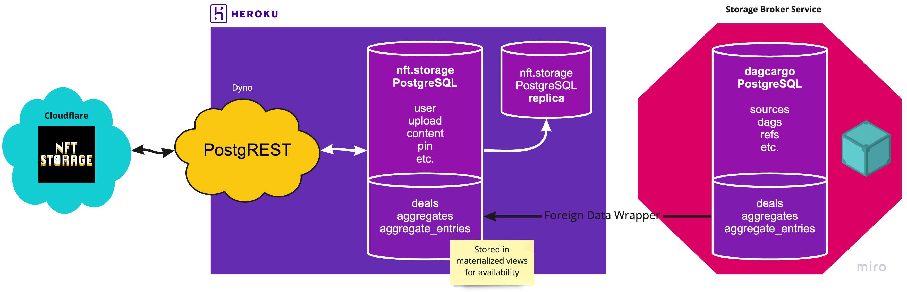

# Infra

Scripts for provisioning nft.storage infrastructure.



# Forking production database to staging

```bash
heroku addons:create heroku-postgresql:premium-3 --app nft-storage-pgrest-staging --fork nft-storage-prod-0 --fast --name=nft-storage-staging-0
```
