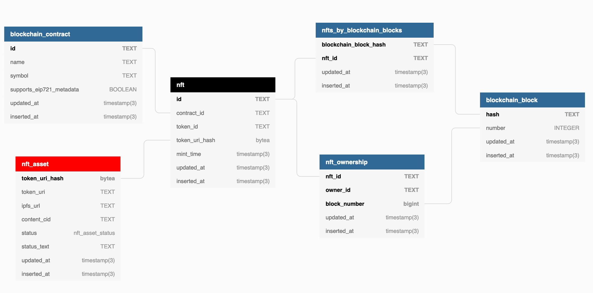
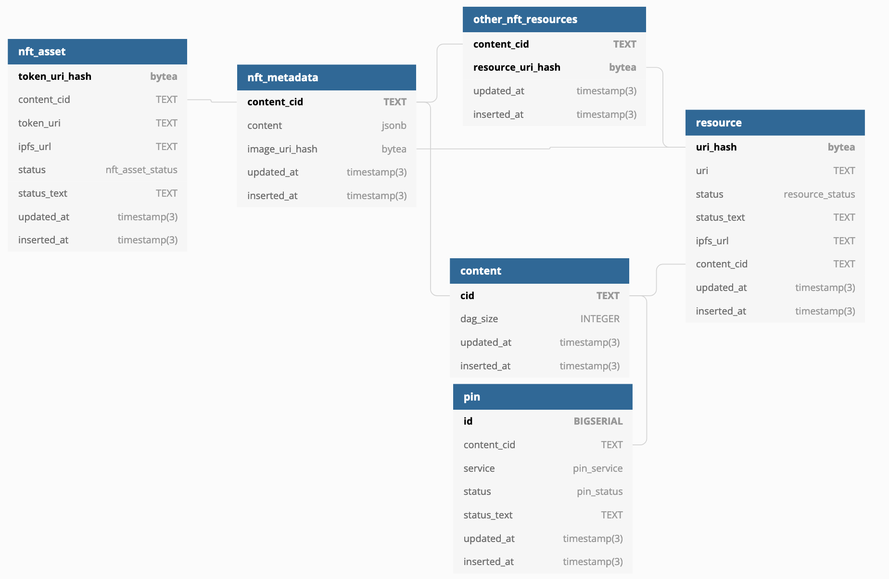
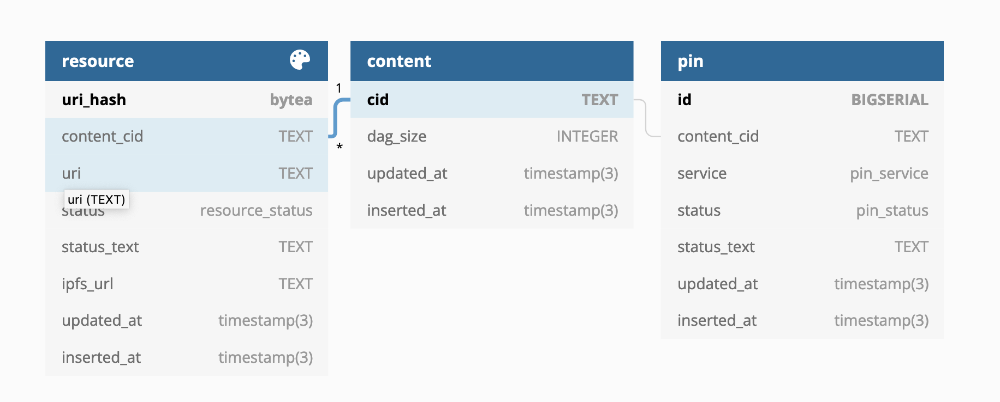

# Niftysave

Scans ethereum for [ERC-721][] Non-Fungible Tokens and replicates all assets
by saving them on [nft.storage][].

## Overview

### Ingestion

Module `ingest.js` continuously runs on heroku pulling data from the [EIP721 Subgraph][] and writing it into Postgres DB on Heroku through [hasura][] graphql-engine.

Process runs two concurrent tasks:

1. Reader task pulls new data in batches from [EIP721 Subgraph][] and queues it in memory for writer to flush.
2. Writer pull one nft from graph at a time and writes it into Postgres DB through [hasura][] graphql-engine.

Postgres SQL function exposed as GraphQL mutation does most of the heavy lifting. It takes apart received data and distributes it across relevant tables.

### Analysis

Module `analyze.js` continuously runs on heroku pulling queued `nft_asset` records (created by ingestion) and performing analysis. Every pulled `nft_asset` is updated to either

1. `Linked` state in which it is linked with corresponding `metadata` and `resources` records.
2. `*Failed` state with information about the failure.

Analyzer performs following tasks:

1. Parse `token_uri` as a valid URL.
2. Infer `ipfs://` URL from the parsed `token_uri`, by recognizing gateway URLs (e.g. https://ipfs.io/ipfs/Qm..) and malformed ipfs:// URLs.
3. Fetch content for the resource. From IPFS if ipfs:// URL can be inferred or from web otherwise.
4. Parse content as JSON.
5. Extract all the URLS from the (metadata) JSON.
6. Derive CID from content.
7. Submit content pin request.

If analyzer succesfully completes above steps it will link `nft_asset` with `metadata`, it's `content` and extracted `resource`s.

Otherwise `nft_asset` status is updated to `*Failed` state with a corresponding failure attached.

### Archiving

Moudle `pin.js` continuously runs on heroku pulling queued `resource` records (created by analyzer) and attempts to pin their content on IPFS.

It performs following tasks:

1. Parse `uri` as a valid URL.
2. Infer `ipfs://` URL from the parsed `uri`, by recognizing gateway URLs (e.g. https://ipfs.io/ipfs/Qm..) and malformed ipfs:// URLs.
3. If IPFS URL is derived submit a pin request to an [IPFS cluster][].
4. If IPFS URL can not be derived, fetch resource from the web and pin by uploading to [IPFS Cluster][].

If all tasks succeed it will link resource with corresponding `content` and `pin` records.

Otherwise `resource` status is updated to `*Failed` state with acorresponding failure attached.

[erc-721]: https://eips.ethereum.org/EIPS/eip-721
[nft.storage]: https://nft.storage/
[eip721 subgraph]: https://thegraph.com/explorer/subgraph/nftstorage/eip721-subgraph
[hasura]: https://hasura.io/
[ipfs cluster]: https://cluster.ipfs.io/
